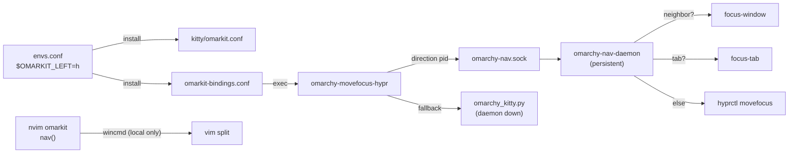

# omarkit

## Goal

Unified nav plugin for omarchy: `envs.conf` drives direction keys across Hyprland, kitty, and nvim. A persistent daemon replaces per-keypress Python spawns (~100ms → ~5ms).

## Architecture



**Protocol:** fire-and-forget, one line per message
- `"<direction> <kitty-pid>"` — from Hyprland binding (full kitty state machine)
- `"resize <direction> <kitty-pid>"` — from Hyprland binding (resize)

nvim navigates/resizes its own splits with `wincmd` only and stays put at the edge — it does not write to the daemon socket.

**Fallback:** if daemon socket is missing, `omarchy-movefocus-hypr` falls back to `omarchy_kitty.py` directly.

## Modifier layers

```
$OMARKIT_MOD  = SUPER         # layer 1 — base focus
$OMARKIT_MOD2 = ALT           # layer 2 — move

MOD              + dir  →  focus window
MOD + MOD2       + dir  →  move window
CTRL + ALT       + dir  →  resize window
```

The focus and move layers share `$OMARKIT_LEFT/DOWN/UP/RIGHT` — one set of direction keys drives every action.

## Tasks

- Config
  - [x] `envs.conf`: `$OMARKIT_LEFT/DOWN/UP/RIGHT/MOD/MOD2/MOD3` as Hyprland config vars
  - [x] `install` upserts envs.conf vars, generates `kitty/omarkit.conf`, symlinks bins, writes `omarkit-bindings.conf`
- Plugin (`omarkit.nvim`)
  - [x] Scaffold matching smart-splits structure
  - [x] IS_NVIM lifecycle: `startup()` / `VimLeavePre`
  - [x] `kitty/omarkit.conf.tmpl` with `kitty_mod` + arrow defaults
  - [x] Kittens: `smart_close.py`, `relative_resize.py`, `omarchy_kitty.py` owned by plugin
  - [x] Replace smart-splits `move_cursor_*` with native `wincmd`
  - [x] Replace smart-splits `resize_*` with `wincmd`
  - [x] nvim navigates/resizes its own splits with `wincmd`; stays put at the edge (no daemon dispatch)
- Bin
  - [x] `omarchy-kitty` smart launcher (moved into plugin, install symlinks)
  - [x] `omarchy-movefocus-hypr` (writes to daemon socket, falls back to `omarchy_kitty.py`)
  - [x] `omarchy-nav-daemon` (persistent socket state machine)
- Daemon
  - [x] Socket listener → IS_NVIM → split → tab → hyprctl
  - [x] `exec-once = omarchy-nav-daemon` in `autostart.conf`
  - [x] Resize protocol (`resize <direction> <pid>`) from Hyprland binding
- Cleanup (omarchy repo)
  - [ ] Remove omarkit bindings from `config/hypr/bindings.conf` (owned by `omarkit-bindings.conf`)
  - [ ] Remove omarkit vars from `config/hypr/envs.conf` (written by install, not committed)
