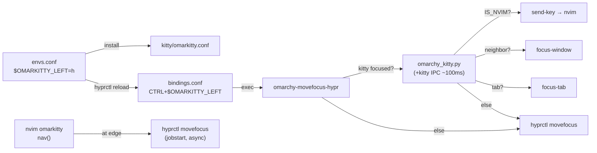
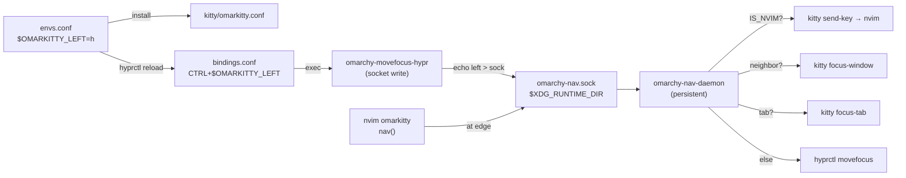

# omarkitty

## Goal

Unified nav plugin for omarchy: `envs.conf` drives direction keys across Hyprland, kitty, and nvim. A persistent daemon replaces per-keypress Python spawns (~100ms → ~5ms).


## Current flow



## Target bus architecture



**Why the daemon:** `omarchy_kitty.py` spawns a new process per keypress and opens a kitty IPC connection (~100ms). The daemon keeps the kitty socket open persistently — dispatch latency drops to ~5ms.

**Protocol:** fire-and-forget, one line per message: `left\n`, `right\n`, etc.
**State:** daemon tracks `IS_NVIM` per kitty window via the OSC user-var set by nvim on startup.

## Modifier layers

```
$OMARKITTY_MOD  = CTRL          # layer 1 — base
$OMARKITTY_MOD2 = SHIFT         # layer 2 — move
$OMARKITTY_MOD3 = ALT           # layer 3 — resize

MOD              + dir  →  focus window
MOD + MOD2       + dir  →  move window
MOD + MOD3       + dir  →  resize window
```

All three layers share `$OMARKITTY_LEFT/DOWN/UP/RIGHT` — one set of direction keys drives every action.

## Tasks

- Config
  - [x] `envs.conf`: `$OMARKITTY_LEFT/DOWN/UP/RIGHT/MOD` as Hyprland config vars
  - [x] `install` upserts envs.conf vars, generates `kitty/omarkitty.conf`, symlinks bin
  - [x] `bindings.conf` CTRL+nav and SUPER ALT+move use `$OMARKITTY_*` vars
- Plugin (`omarkitty.nvim`)
  - [x] Scaffold matching smart-splits structure
  - [x] IS_NVIM lifecycle: `startup()` / `VimLeavePre`
  - [x] `kitty/omarkitty.conf.tmpl` with `kitty_mod` + arrow defaults
  - [x] Kittens: `smart_close.py`, `relative_resize.py` moved into plugin
  - [ ] Replace smart-splits `move_cursor_*` with native `wincmd`
  - [ ] Replace smart-splits `resize_*` with `wincmd`
  - [ ] Wire daemon socket write at nvim edge
- Bin
  - [x] `omarchy-kitty` smart launcher (renamed from `omarchy-terminal`, moved into plugin)
  - [ ] `omarchy-movefocus-hypr`: write to socket, `hyprctl` fallback if daemon down
- Daemon (`omarchy-nav-daemon`)
  - [ ] Socket listener → IS_NVIM → split → tab → hyprctl
  - [ ] Reconnect kitty socket on error
  - [ ] `exec-once = omarchy-nav-daemon` in `hyprland.conf`
- Cleanup
  - [ ] Remove `omarchy_kitty.py` from chezmoi
  - [ ] Remove `smart-splits` from nvim plugins
